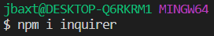
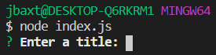
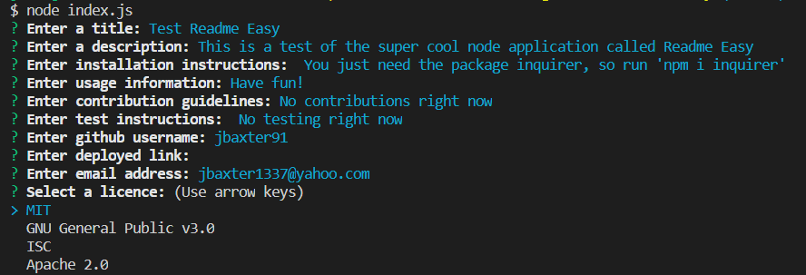
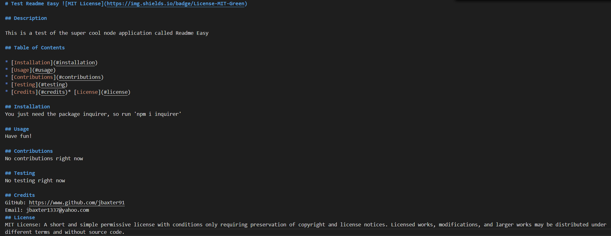

# Readme Easy 

## Description

Github readme file done easy!  This node application will help you generate a quick and professional readme

## Table of Contents

* [Installation](#installation)
* [Usage](#usage)
* [Contributions](#contributions)
* [Testing](#testing)
* [Credits](#credits)
* [License](#license)

## Installation

Just clone the repository, install inquirer, and run the application in node

## Usage

Run node index.js and follow the on screen prompts to create your readme file

Follow all the instructions like, and i will generate your new amazing readme

Your finished readme will be placed inside a folder called "output"

## Contributions
Contribute as much as you like :D

## Testing
If you want to test this, let me know

## Credits
GitHub: https://www.github.com/jbaxter91

Email: jbaxter1337@yahoo.com
## License
MIT License: A short and simple permissive license with conditions only requiring preservation of copyright and license notices. Licensed works, modifications, and larger works may be distributed under different terms and without source code.